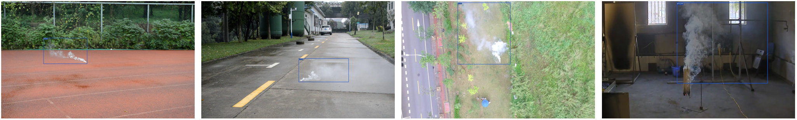

<!--  -->

## Introduction
SSmokeNet is a lightweight network for smoke detection, with a simpler design but significant performance!
<!-- SSmokeNet is a lightweight network for small smoke detection, with a simpler design but significant performance! -->
<!-- It is specifically designed for small smoke detection, such as early and distant smoke, and it can be applied in various environments. -->
<!-- This repo is an implementation of PyTorch version SSmokeNet. -->

In addition, we provide a smoke dataset composed of real smoke images and annotate it manually, termed the annotated real smoke of Xi’an Jiaotong University ([XJTU-RS](https://pan.baidu.com/s/1XroD3qLwRH5tipsyDDzhSg)), and code is <b>CIFR<b>. 
<!-- These real images are from two benchmark datasets: [CVPR](https://cvpr.kmu.ac.kr/) and [USTC](http://smoke.ustcdu.cn/datasets.html).  -->
<!-- Our dataset is available. -->


<!-- For more details, please refer to our [report on Arxiv](https://arxiv.org/abs/2107.08430). -->


## Benchmark

#### Standard Models. 
| Model | size | AP<sub>S | AP<sub>M | AP<sub>L | AR<sub>S | AR<sub>M | AR<sub>L | AP|AR|Params<br>(M)|weights|
| ------ |:---: | :---:   | :---:    |:---:     |:---:  | :---: | :----: | :----: | :----: | :----: | :----: |
|SSmokeNet   |640  |0.555 |0.644 |0.756 |0.562|0.697|0.790|0.724 |0.715 |11.20| [down](https://pan.baidu.com/s/1RqEBkgskFKZwZAqrYwVwtw) |

## Quick Start

<details>
<summary>Installation</summary>

Step1. Install SSmokeNet.
```shell
git clone git@github.com:jingjing-maker/SSmokeNet.git
cd SSmokeNet
pip3 install -U pip && pip3 install -r requirements.txt
pip3 install -v -e . 
```

Step2. Install [pycocotools](https://github.com/cocodataset/cocoapi).

```shell
pip3 install cython; pip3 install 'git+https://github.com/cocodataset/cocoapi.git#subdirectory=PythonAPI'
```

</details>

<details>
<summary>Demo</summary>
Step1. Download a pretrained model from the benchmark table.

Step2. Use either -n or -f to specify your detector's config. For example:

```shell
python tools/demo.py image -n SSmokeNet -c /path/to/your/ssmokenet.pth --path ./test_img/ --conf 0.25 --nms 0.45 --tsize 640 --save_result --device [cpu/gpu]
```
or
```shell
python tools/demo.py image -f exps/default/ssmokenet.py.py -c /path/to/your/ssmokenet.pth --path ./test_img/ --conf 0.25 --nms 0.45 --tsize 640 --save_result --device [cpu/gpu]
```
eg:

python tools/demo.py image -f exps/default/ssmokenet.py -c weight/final.pth --path ./test_img/ --conf 0.25 --nms 0.45 --tsize 640 --save_result --device [gpu]


Demo for video: 
```shell
python tools/demo.py video -n SSmokeNet -c /path/to/your/ssmokenet.pth --path /path/to/your/video --conf 0.25 --nms 0.45 --tsize 640 --save_result --device [cpu/gpu]
```

</details>

<details>
<summary>Reproduce our results on COCO</summary>

Step1. Prepare COCO dataset
```shell
cd <SSmokeNet_HOME>
ln -s /path/to/your/COCO ./datasets/COCO
```

Step2. Reproduce our results on COCO by specifying -n:

```shell
python tools/train.py -n SSmokeNet -d 1 -b 64 --fp16 -o [--cache]  
```


* -d: number of gpu devices
* -b: total batch size, the recommended number for -b is num-gpu * 8
* --fp16: mixed precision training
* --cache: caching imgs into RAM to accelarate training, which need large system RAM. 

When using -f, the above commands are equivalent to:
```shell
python tools/train.py -f exps/default/ssmokenet.py -d 8 -b 64 --fp16 -o [--cache]
```

**Multi Machine Training**

We also support multi-nodes training. Just add the following args:
* --num\_machines: num of your total training nodes
* --machine\_rank: specify the rank of each node

Suppose you want to train SSmokeNet on 2 machines, and your master machines's IP is 123.123.123.123, use port 12312 and TCP.  
On master machine, run
```shell
python tools/train.py -n SSmokeNet -b 128 --dist-url tcp://123.123.123.123:12312 --num-machines 2 --machine-rank 0
```
On the second machine, run
```shell
python tools/train.py -n SSmokeNet -b 128 --dist-url tcp://123.123.123.123:12312 --num-machines 2 --machine-rank 1
```

</details>


<details>
<summary>Evaluation</summary>

We support batch testing for fast evaluation:

```shell
python tools/eval.py -n SSmokeNet -c /path/to/your/ssmokenet.pth -b 64 -d 1 --conf 0.001 [--fp16] [--fuse]                         
```

* --fuse: fuse conv and bn
* -d: number of GPUs used for evaluation. DEFAULT: All GPUs available will be used.
* -b: total batch size across on all GPUs

To reproduce speed test, we use the following command:
```shell
python tools/eval.py -n SSmokeNet -c /path/to/your/ssmokenet.pth -b 1 -d 1 --conf 0.001 --fp16 --fuse
```

</details>


## Deployment


1.  [MegEngine in C++ and Python](./demo/MegEngine)
2.  [ONNX export and an ONNXRuntime](./demo/ONNXRuntime)
3.  [TensorRT in C++ and Python](./demo/TensorRT)
4.  [ncnn in C++ and Java](./demo/ncnn)
5.  [OpenVINO in C++ and Python](./demo/OpenVINO)


## Third-party resources
* The ncnn android app with video support: [FeiGeChuanShu](https://github.com/FeiGeChuanShu)
* SSmokeNet with Tengine support: [BUG1989](https://github.com/BUG1989)
* SSmokeNet + ROS2 Foxy: [Ar-Ray](https://github.com/Ar-Ray-code)
* SSmokeNet Deploy DeepStream: [nanmi](https://github.com/nanmi)
* SSmokeNet ONNXRuntime C++ Demo: [DefTruth](https://github.com/DefTruth)
* Converting COCO datasets to format for SSmokeNet: [Daniel](https://github.com/znsoftm)

## Cite SSmokeNet
If you use SSmokeNet in your research, please cite our work by using the following BibTeX entry:
    
  ( To be continued.)
